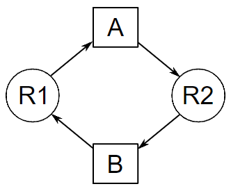

# DEADLOCK NEDİR
Deadlock ya da kilitlenme, iki ya da daha fazla eylemin devam etmek için birbirlerinin bitmesini beklemesi ve sonuçta ikisinin de devam edememesi durumu. 

## Örnek Olarak

Bu görselde A işleminin R2 kaynağına ihtiyacı var ancak R2 kaynağını B işlemi kullanıyor ve
B işleminin bitebilmesi için de R1 kaynağına ihtiyacı var ancak R1'i A kaynağı kullanıyor ve ikisi de işlemlerini tamamlayamıyor kilitlenme yaşanıyor.